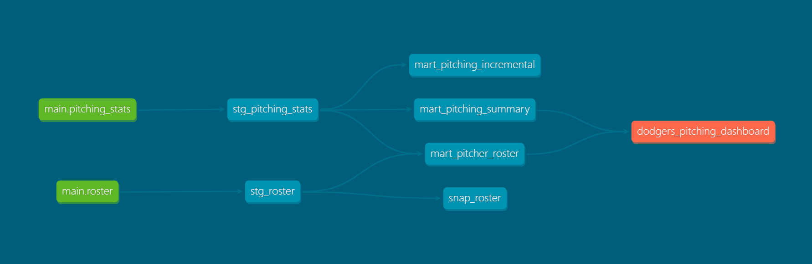

# Dodgers Pitching Analytics Pipeline

A data engineering portfolio project that builds an end-to-end ELT pipeline for analyzing LA Dodgers pitching performance. Data is extracted from the MLB Stats API, loaded into a SQLite database, and transformed using dbt for analytics and Power BI dashboarding.

## Architecture



```
MLB Stats API
     │
     ▼
 ingestion/          ← Extract & Load (Python + SQLAlchemy)
     │
     ▼
 baseball.db         ← SQLite raw tables (roster, pitching_stats)
     │
     ▼
 dodgers_dbt/        ← Transform (dbt)
  ├── staging/       ← Rename & clean raw tables (views)
  ├── mart/          ← Analytics-ready models (tables)
  └── snapshots/     ← SCD Type 2 history tracking
     │
     ▼
 Power BI Dashboard
```

## Pipeline Steps

1. **Extract** — `ingestion/fetch.py` calls the MLB Stats API for the 2025 Dodgers roster and pitching stats
2. **Clean** — `transform/clean.py` normalizes raw JSON into typed DataFrames
3. **Load** — `ingestion/load.py` + `db/manager.py` write data to SQLite:
   - `roster` uses full-reload (truncate + insert)
   - `pitching_stats` uses incremental append (deduplicates by `player_id`)
4. **Transform** — `dbt build` runs staging views, mart tables, and data tests
5. **Snapshot** — `snap_roster` tracks historical position changes (SCD Type 2)

## Project Structure

```
de-portfolio-project/
├── main.py                    # Pipeline orchestrator
├── pipeline_logger.py         # Structured logging (console + dated log file)
├── requirements.txt
├── .env.example
│
├── ingestion/
│   ├── fetch.py               # MLB Stats API calls
│   └── load.py                # Load DataFrames into SQLite
│
├── transform/
│   └── clean.py               # Raw JSON → typed DataFrames
│
├── db/
│   └── manager.py             # DatabaseManager (SQLAlchemy wrapper)
│
└── dodgers_dbt/
    ├── dbt_project.yml
    ├── models/
    │   ├── staging/
    │   │   ├── stg_roster.sql
    │   │   └── stg_pitching_stats.sql
    │   └── mart/
    │       ├── mart_pitcher_roster.sql        # Roster + stats join, pitcher role
    │       ├── mart_pitching_summary.sql      # Eligible pitchers + elite flag
    │       └── mart_pitching_incremental.sql  # Incremental pitching stats
    ├── macros/
    │   ├── classify_workload.sql              # Starter vs. Reliever (threshold: 50 IP)
    │   └── is_elite_pitcher.sql               # Elite vs. Not Elite (threshold: 3.0 ERA)
    ├── snapshots/
    │   └── snap_roster.sql                    # Track position changes over time
    └── tests/
```

## dbt Models

| Model | Materialization | Description |
|---|---|---|
| `stg_roster` | View | Renamed columns from raw `roster` table |
| `stg_pitching_stats` | View | Renamed columns from raw `pitching_stats` table |
| `mart_pitcher_roster` | Table | Roster + pitching stats joined; pitcher role via `classify_workload` macro |
| `mart_pitching_summary` | Table | Pitchers with ≥10 IP; elite status via `is_elite_pitcher` macro |
| `mart_pitching_incremental` | Incremental | Appends new pitchers only; unique key = `player_id` |
| `snap_roster` | Snapshot | SCD Type 2 history on `player_position` |

### Macros

- **`classify_workload(innings_pitched, threshold=50)`** — returns `'Starter'` if IP ≥ 50, else `'Reliever'`
- **`is_elite_pitcher(era_column, threshold=3.0)`** — returns `'Elite'` if ERA < 3.0, else `'Not Elite'`

## Setup

### Prerequisites

- Python 3.10+
- pip

### Installation

```bash
git clone https://github.com/hmnguyen-2805/de-portfolio-project.git
cd de-portfolio-project

python -m venv .venv
source .venv/bin/activate  # Windows: .venv\Scripts\activate

pip install -r requirements.txt
```

### Configuration

Copy `.env.example` to `.env` and update the paths:

```env
DB_PATH=baseball.db
DBT_PROJECT_DIR=/absolute/path/to/de-portfolio-project/dodgers_dbt
```

Configure your dbt profile in `~/.dbt/profiles.yml`:

```yaml
dodgers_dbt:
  target: dev
  outputs:
    dev:
      type: sqlite
      threads: 1
      database: baseball
      schema: main
      schemas_and_paths:
        main: /absolute/path/to/baseball.db
      schema_directory: /absolute/path/to/de-portfolio-project
```

### Run the Pipeline

```bash
python main.py
```

This runs the full pipeline: fetch → clean → load → `dbt build`.

To run dbt steps independently:

```bash
cd dodgers_dbt

dbt run          # Build all models
dbt test         # Run data quality tests
dbt snapshot     # Run SCD snapshot
dbt build        # Run + test in one command
```

## Data Source

**MLB Stats API** (public, no authentication required)

- Roster: `https://statsapi.mlb.com/api/v1/teams/{teamId}/roster?season={season}`
- Pitching stats: `https://statsapi.mlb.com/api/v1/stats?stats=season&group=pitching&teamId={teamId}&season={season}&gameType=R&playerPool=ALL`

Team ID for the LA Dodgers: `119`

## Data Quality Tests

dbt schema tests are defined for all staging and mart models:

- `player_id` — `not_null`, `unique`
- `player_name`, `player_position`, `era`, `strikeouts`, `innings_pitched` — `not_null`

## Tech Stack

| Layer | Tool |
|---|---|
| Language | Python 3.10+ |
| Data manipulation | pandas, numpy |
| Database | SQLite via SQLAlchemy |
| HTTP | requests |
| Transformation | dbt-core, dbt-sqlite |
| Config | python-dotenv |
| Visualization | Power BI |

## Output

Analytics-ready mart tables feed a Power BI dashboard showing 2025 Dodgers pitching performance — ERA, strikeouts, innings pitched, pitcher role (Starter/Reliever), and elite pitcher classification.
